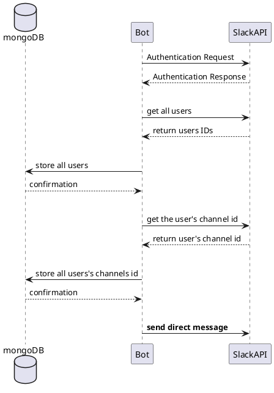

In stead of going over all the different steps, I'm going to share a overview about the process which I followed for [alterego](https://github.com/Anarkis/alterego)

Luckily, the [Slack api](https://api.slack.com/) is really well documented. It makes quite straight forward the develop process.

### Design decisions
- The project was designed to be cloud based with the stack: [helm](https://helm.sh/), [docker](https://www.docker.com/), [kubernetes](https://kubernetes.io/), [python](https://www.python.org/) and [mongoDB](https://www.mongodb.com/)
- the bot and mongoDB will be two `microservices`
- the bot will send a predefined text to a group of slack users
- the bot will start daily (from Monday until Friday) at 11.30, will send the messages and will finish its execution
- mongoDB will have a `pvc` defined, in order to avoid data loss.

### To have in mind
Being the first time that I have dug on Slack API I would like to point out:
- Every user has an unique id _(no surprise over here)_
- Every user has an **unique channel id**. This channel will be the one which we will interact.
- Each action (**even a reaction**) in a specific channel, has related a timestamp.
- Depending on the amount of request to the Slack API in a sort time, we can get a nice answer "too many petitions" [rate limits](https://api.slack.com/docs/rate-limits)

### Flow overview
 Here we can see the flow to obtain all private channels for the Slack users:

This flow, should will happen only once. After that the interaction will be between the bot and the Slack API.

### Summarising
Creating a first version of a Slack Bot with some direct interaction with users, is _super fun_ and highly recommended due to its _well documented_ API giving a quick final result.

In the first version that I made, didn't put effort on the robustness of the communication between the bot and the API. This is a key feature if you want a permanent solution running smoothly.

#### Resources
[Local kubernetes](https://docs.docker.com/docker-for-mac/kubernetes/)
[Slack api](https://api.slack.com/)
[alterego](https://github.com/Anarkis/alterego)
